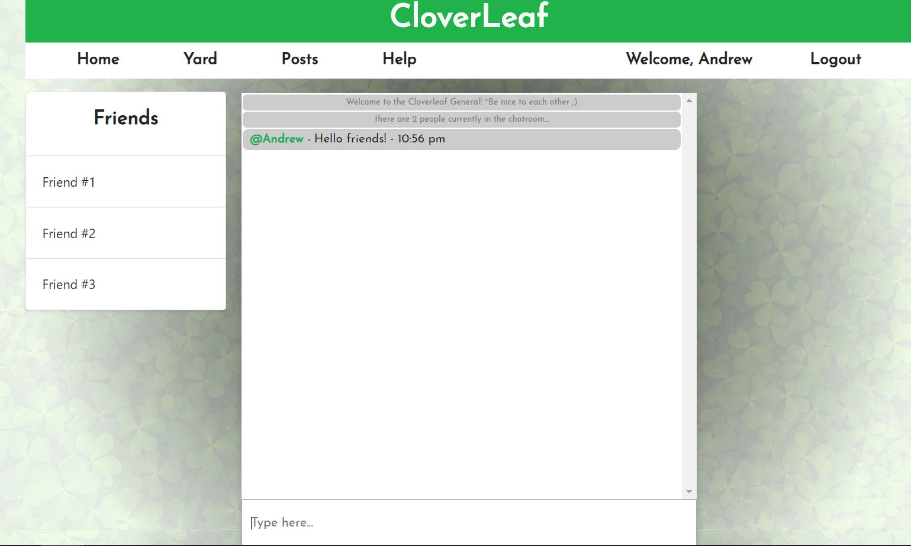

# Cloverleaf

## Description

Cloverleaf:

A React site where users can post to forums, connect and photosynthesize with friends, and possibly even sell goods in the yard sale section. It’s kind of like Twitter without the character limits...and Russian bots.

### Heroku Link:

https://cloverleaf.herokuapp.com/

### Running a local server

Requirements:

- Express
- Mongoose
- Passport
- Sequelize
- Socket.io
- Axios
- React
- Redux

Be sure to run `npm install` to download all of the node_module dependencies on both the server side and client side before trying to run locally! The application can be started through 'npm start'. The default port is `localhost:3000`.

### Authors:

- Carl Vega
- Andrew Le
- Andrew Manley
- Desiree Howell

### Acknowledgements

- The Coding Bootcamp at UNC Chapel Hill
